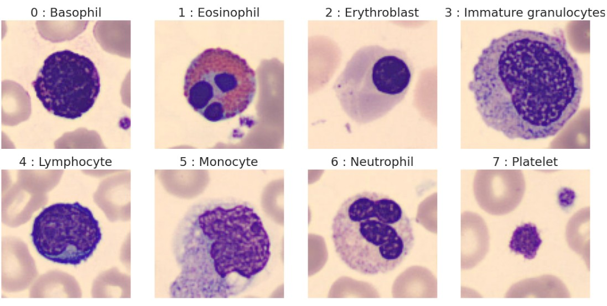
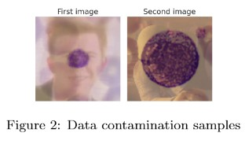
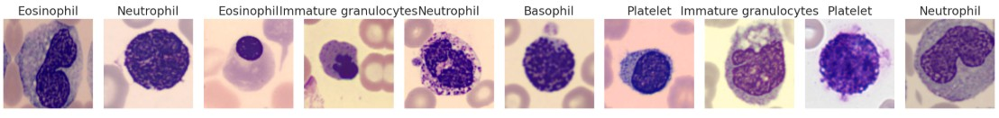
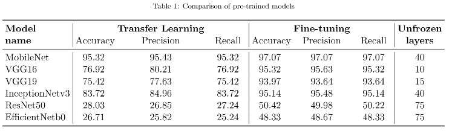
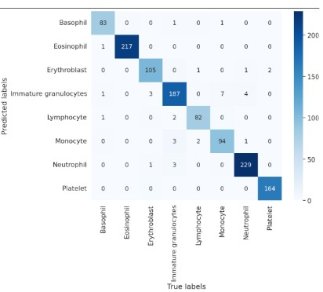

# Blood Cell Image Classification

* Dataset: White Blood Cell Dataset
* Dataset Size: 13,759
  
 

# Steps Performed :

## Data Inspection:
Two recurring image types unrelaed to blood cell classes, acting a a contaminants across most class labels.Total 200 instances of the first contaminants and 1600 instances of the second contaminants were removed.

## Data Augmentation :
To address the issue of data imbalance we generated the synthetic images of the classes which contains less labels in comparison to others. 

## Models Used:

### 1. Custom Model : 

Custom CNN model is inspired by the U-Net architecture has neen used. Final classification used the global average pooling and dense softmax  layer for ouput probablities.

### 2. Using Transfer Learning :

For transfer learning we employed serveral pretrained model which has been summarized below.

## Result:

For Classification problem of this nature, fine tuning a pretrained model significantly outperforms a training a custom model from scratch.

